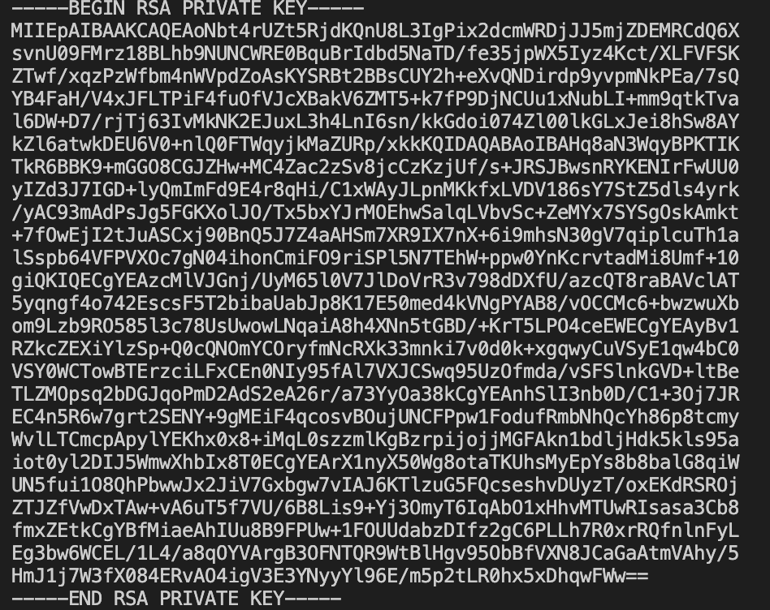

# Week 01 Lab — Key Pair Generation

## Screenshot Evidence

If using OpenSSL:
1. Capture a screenshot showing:
  - The command used to generate the private key
  - The command used to extract the public key
2. Save it as:

**assets/screenshots/week-01/keypair-generation.png**

3. Embed the screenshot below:

****

If using a browser-based generator, capture the generated key pair screen (redact sensitive portions of the private key before committing).

---

## Key Identification
**Which file is the public key?**
The public key was tagged in the command when named and is the shorter of the two.

**Which file is the private key?**
The private key was tagged in the command when named and is the longer of the two by design and in my experience.

---

## Key Properties
Briefly describe:
Public keys are safe to share because it allows for encryption not decryption. It is only a lock.
Private keys are not safe to share becuase it is the only key that can decrypt the encrypted data and reveal ownership.

---

## Security Scenario
What would happen if someone obtained your private key?

Explain the risk in terms of:
If someone obtains my private key, they can pretend to be me, access protected data, and break the trust that secure systems rely on. The private key is used to prove identity, systems will accept any actions performed with that key as legitimate. An attacker could decrypt sensitive information or authenticate to services as if they were the real owner ie me. As a result, the integrity and trust of the system would be compromised.

---

## Observations
Document three observations from this lab.

### Observation 1
For the command to run with both key generations, I would have to place "&&" as a separator. 

### Observation 2
Both keys' header and footer are placed there for acknowledgement so there is no confusion. 

### Observation 3
The private key is much larger than the public.

---

## Reflection
In 3–5 sentences, explain:

Why must the private key remain secret in a PKI system?

In a PKI system, it is very important to keep the private key secure because it is what proves the identity of the owner. Systems will trust that only the correct person has access to that key. If someone else got the private key, they could pretend to be the real owner and access protected systems or data. This would break the trust that PKI systems depend on and could compromise the security of the system.
