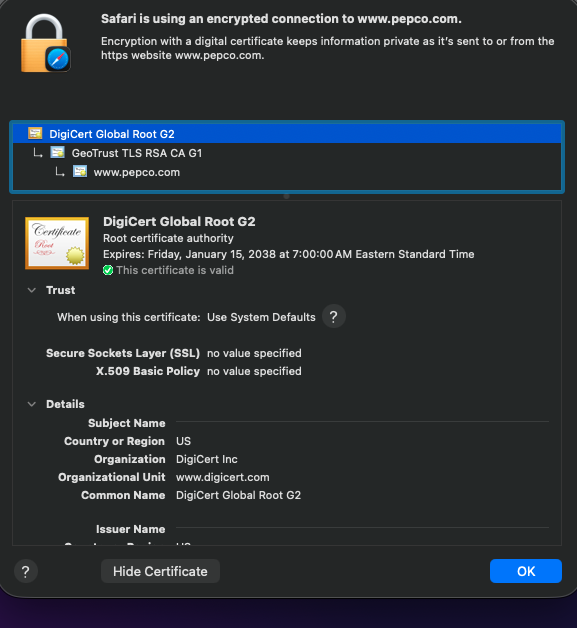

# Week 01 Mini Lab — Trust Chain Validation

## Screenshot Evidence

Capture a screenshot of the Certification Path (certificate chain) from your browser.

Save it as:

assets/screenshots/week-01/trust-chain-validation.png

Embed the screenshot below:

## Website Information

**Website inspected:**  
https://www.pepco.com

---

## Certificate Chain Breakdown

**Leaf (Server) Certificate**  
www.pepco.com

**Intermediate Certificate Authority**
GeoTrust TLS RSA CA G1

**Root Certificate Authority (Trust Anchor)**
DigiCert Global Root G2

---

## Trust Anchor Verification

Is the Root CA marked as trusted by your system?
Yes

If yes, explain where that trust comes from (OS/browser root store).

A Root CA is like a trusted authority that approves certificates. My computer has that authority on its trusted list, it will trust the certificates it issues.

---

## Observations

Document three observations about the certificate.

### Observation 1
I noticed that thee root is at the top of the chain just like in the lesson which reconfirms mental and visual validation.
Trust flows down and validation walks up.

### Observation 2
The Root CA validation period is much longer than that of the intermediate and leaf certifications

### Observation 3
If the certificate is trusted and all checks pass, users sees a lock icon in the browser and the site loads securely with no warnings

---

## Reflection

In 3–5 sentences, explain:
- Why the Root certificate is called a trust anchor
- How validation walks the certificate chain
- What would happen if the Root CA were not trusted

It’s called a trust anchor because it’s the certificate the system starts with when deciding whether other certificates can be trusted. If the root is trusted, everything connected (other lower level certificates) to it can be trusted. The validation of the starts at the leaf certificate then up to the root again; checking things such as signatures, if chain reaches the trust root, the expiration and matching host names. If the Root CA is not trusted like something fails, the browser shows a security warning. 

