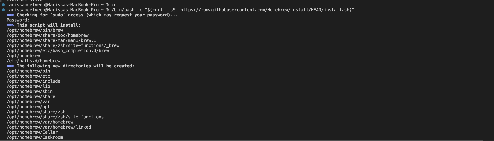
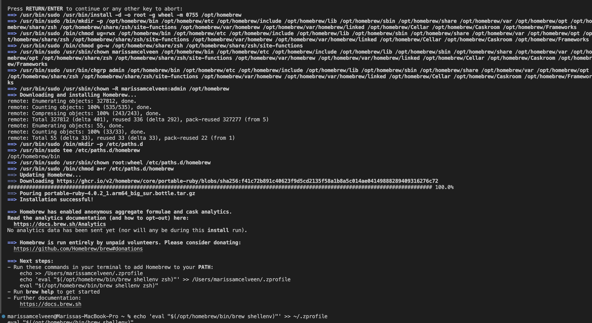
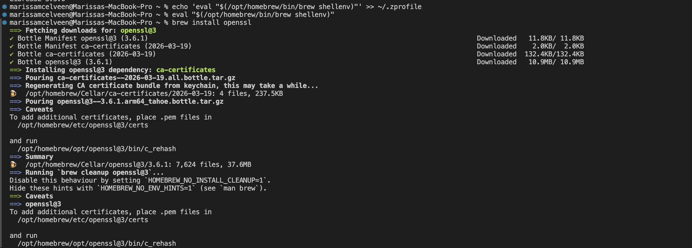

# PKI Troubleshooting Runbook

Runbook title: macOS LibreSSL Incompatibility with OpenSSL Flags — Install Homebrew OpenSSL Fix

## Problem Statement

I attempted to simulate an openssl certificate with a past validity window of: -not_before January 1, 2023 at 00:00:00 (UTC) and not after January 2, 2023 at 00:00:00 (UTC). This reads as -not_before 20230101000000Z -not_after 20230102000000Z in openssl. I expected the command to generate the expired certificate but instead it threw an error of "unknown option -not_before".

## Environment

Certificate type or component involved:
- x509
- openssl commands "-not_before" 
- openssl commands "-not_after"

Any relevant configuration details:
- Operating System: macOS
- Terminal Used: Integrated terminal in Visual Studio Code (zsh shell)
- OpenSSL Version (if applicable): LibreSSL 3.3.6

## Symptoms

- "unknown option -not_before"
- "bad number of days: too small"

## Diagnostic Steps
These are observations and commands/steps I used to diagose my macOS LibreSSL Incompatibility with OpenSSL Flags issue.

I experienced an error to simulate a real-world expiration event by creating a certificate with a past validity window: 
openssl x509 -req \
  -in labs/week-05/submissions/expiration-stretch/test_csr.pem \
  -signkey labs/week-05/submissions/expiration-stretch/test_key.pem \
  -out labs/week-05/submissions/expiration-stretch/test_cert_expired.pem \
  -set_serial 02 \
  -startdate 20230101000000Z \
  -enddate 20230102000000Z

output: "unknown option -not_before"
  
 The issue was that my openssl threw an error for "unknown option -not_before". I knew the error was in my openssl itself, to complete the lab ,I needed to do an install 'brew install openssl'. 

## Resolution

*Describe exactly what fixed the issue — the specific command, config change, or action taken.*
These are observations and commands/steps I used to resolved my macOS LibreSSL Incompatibility with OpenSSL Flags issue.

1. openssl --version. **I observed LibreSSL 3.3.6, this is macoS openssl default**
2. Install Homebrew: /bin/bash -c "$(curl -fsSL https://raw.githubusercontent.com/Homebrew/install/HEAD/install.sh)". **I observed a password prompt. After inputting my password, the script installed folders/directories with homebrew.**
3. **I observed a prompt "Press RETURN/ENTER to continue or any other key to abort:" I selected " ENTER" to continue**
4. Steps 5 and 6 need to be ran immediately after step 2 completes
5. Added Homebre to my path (for Apple Silicon Macs) : echo 'eval "$(/opt/homebrew/bin/brew shellenv)"' >> ~/.zprofile
6. eval "$(/opt/homebrew/bin/brew shellenv)"

## Prevention Note
When errors are being thrown and cpmmand are unrecognized, check the openssl version. If the output is: 'LibreSSL ...'
know that you will need to install homebrew to fetch the desired output.

Lab this scenario is drawn from: `/week-05/submissions/expiration-stretch/lab-03-expiration-stretch.md`

